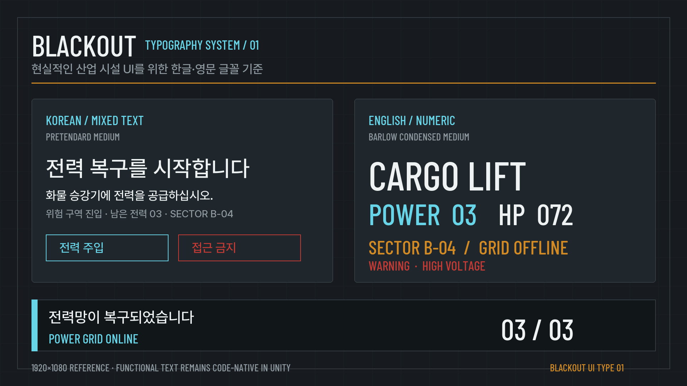

# BLACKOUT — 폰트·타이포그래피 가이드

> 목적: 한국어와 영어가 섞인 UI, 자막, 월드 표지판을 한 게임처럼 보이게 만드는 글자 규칙  
> 기준 화면: Windows PC · 1920×1080  
> 관련 문서: [BLACKOUT 아트 바이블](BLACKOUT_ArtBible.md)  
> 상태: 글꼴 원본 배치 완료 · Unity TextMeshPro 실제 화면 검증 전

## 1. 한 문장 방향

**한글은 빠르게 읽히고, 영문과 숫자는 오래된 공공 산업 설비의 계기판처럼 좁고 단단하게 보인다.**

과장된 우주선용 글꼴을 화면 전체에 쓰지 않는다. 글꼴보다 정보의 크기, 굵기, 색과 배치가 먼저 읽혀야 한다.

## 2. 시각 기준 이미지

이 이미지는 실제 추천 글꼴 파일로 2026-09-10에 만든 1920×1080 방향 확인용 시안이다. 완성 UI 화면이 아니며, 버튼 글자와 수치 같은 실제 기능 텍스트는 Unity에서 TextMeshPro로 표시한다.

## 3. 채택 글꼴

| 역할 | 글꼴 | 기본 굵기 | 사용 범위 |
|---|---|---|---|
| 한국어·혼합 문장 | **Pretendard** | Medium, SemiBold | HUD 문장, 버튼, 자막, 임무, 설정, 한영 혼합 문장 |
| 영문·숫자 전용 | **Barlow Condensed** | Medium, SemiBold, Bold | 구역명, 장비명, 전력·체력 수치, 짧은 경고 코드 |
| 단일 글꼴 대안 | **IBM Plex Sans KR** | Regular, Medium, SemiBold | 글꼴 두 종류를 관리하기 어려울 때 전체 UI 통일 |
| 제한적 강조 후보 | **Oxanium** | SemiBold | 로고나 부팅 화면의 짧은 영문 한 줄만 검토 |

### Pretendard를 기본으로 쓰는 이유

- 한글과 영문을 함께 지원해 `전력 03 / POWER 03` 같은 혼합 문장이 안정적이다.
- 작은 크기의 메뉴와 자막에서도 글자 모양이 분명하다.
- 9가지 굵기가 있지만 프로젝트에서는 필요한 굵기만 가져올 수 있다.

### Barlow Condensed를 영문·숫자에 쓰는 이유

- 도로 표지, 차량 번호판, 버스와 철도에서 영향을 받은 글꼴이라 공공 화물 시설과 어울린다.
- 폭이 좁아 제한된 HUD 슬롯에 긴 장비명과 숫자를 넣기 쉽다.
- 장식적인 SF 글꼴보다 현실적인 설비 라벨에 가깝다.

## 4. 사용 규칙

| 텍스트 종류 | 글꼴·굵기 | 1920×1080 시작 크기 | 표기 예시 |
|---|---|---:|---|
| 자막·임무 설명 | Pretendard Medium | 32~38px | `화물 승강기에 전력을 공급하십시오.` |
| 버튼·상호작용 | Pretendard SemiBold | 30~36px | `전력 주입`, `상호작용` |
| HUD 보조 문구 | Pretendard Medium | 26~32px | `남은 전력 03` |
| 구역·장비 라벨 | Barlow Condensed SemiBold | 32~48px | `SECTOR B-04`, `CARGO LIFT` |
| 핵심 수치 | Barlow Condensed SemiBold/Bold | 44~72px | `HP 072`, `03 / 03` |
| 위험 경고 | Pretendard Bold 또는 Barlow Condensed Bold | 32~48px | `접근 금지`, `HIGH VOLTAGE` |

크기는 출발값이다. 실제 게임 카메라와 플레이 거리에서 읽어 보고 조정한다. Light나 Thin 굵기는 어두운 배경에서 끊겨 보이므로 사용하지 않는다.

### 한글과 영문이 한 문장에 섞일 때

- 한 TextMeshPro 객체 안의 혼합 문장은 Pretendard로 통일한다.
- Barlow Condensed는 영문·숫자만 들어가는 별도 라벨이나 수치 객체에 사용한다.
- 같은 문장 안에서 글꼴을 자주 바꾸지 않는다. 글자 높이와 기준선이 달라져 읽기 흐름이 깨진다.

### 대문자와 글자 간격

- Barlow Condensed 라벨은 짧은 영문 대문자를 기본으로 한다.
- 글자 간격은 기본값에서 소폭만 넓힌다. 긴 문장 전체를 대문자로 만들지 않는다.
- 한글은 인위적으로 넓히지 않고 기본 간격을 유지한다.

## 5. 색과 상태

아트 바이블의 의미 색을 그대로 사용한다.

| 의미 | 색 | 사용 예 |
|---|---|---|
| 기본 정보 | `#EEF2F3` | 본문, 수치, 버튼 |
| 보조 정보 | `#8E999F` | 설명, 비활성 상태 |
| 정상 전력 | `#67D5E7` | 전력 수치, 복구 완료 |
| 주의 | `#D18A24` | 오프라인, 확인 필요 |
| 위험·실패 | `#C43A35` | 접근 금지, 적대 상태 |

색만으로 상태를 구분하지 않는다. 청록은 세로 막대나 원형 소켓, 적색은 삼각 경고나 점멸처럼 형태 차이를 함께 둔다.

## 6. 금지 사항

- 자막과 메뉴 전체에 Oxanium 같은 강한 SF 글꼴을 사용하지 않는다.
- 한글 본문에 Barlow Condensed를 억지로 대체하지 않는다. Barlow Condensed에는 한글 글자가 없다.
- 검은 배경 위에 Thin·Light 굵기를 사용하지 않는다.
- 텍스트에 강한 외곽선, 네온 번짐, 글리치 효과를 상시 적용하지 않는다.
- 이미지에 버튼명이나 수치를 미리 구워 넣지 않는다. 언어 변경과 접근성 크기 조절이 불가능해진다.

## 7. Unity TextMeshPro 적용

1. 가변 글꼴 파일보다 `Medium`, `SemiBold`, `Bold` 고정 TTF 파일을 우선 가져온다.
2. Pretendard Font Asset은 한국어 글자 추가가 가능하도록 `Dynamic`으로 시작하고 Multi Atlas를 켠다.
3. Barlow Condensed는 영문 대문자, 숫자, 기본 문장부호만 포함한 작은 Static Atlas로 만들 수 있다.
4. 공통 TMP Style 또는 프리팹에서 글꼴, 크기, 색을 관리한다. 화면마다 직접 값을 복사하지 않는다.
5. 1920×1080뿐 아니라 창 크기를 줄인 화면에서도 자막, 버튼, HUD 숫자가 잘리지 않는지 확인한다.
6. 빌드 전 실제 게임에서 필요한 한글이 모두 생성되는지 확인하고, 누락 글자와 아틀라스 메모리를 기록한다.

## 8. 출처와 라이선스

| 글꼴 | 공식 배포처 | 라이선스 | 프로젝트 사용 판단 |
|---|---|---|---|
| Pretendard 1.3.9 | [공식 GitHub](https://github.com/orioncactus/pretendard/releases/tag/v1.3.9) | [SIL Open Font License 1.1](https://github.com/orioncactus/pretendard/blob/main/LICENSE) | 게임 포함 가능. 글꼴 파일과 라이선스 사본을 함께 관리 |
| Barlow Condensed | [Google Fonts 저장소](https://github.com/google/fonts/tree/main/ofl/barlowcondensed) | [SIL Open Font License 1.1](https://github.com/google/fonts/blob/main/ofl/barlowcondensed/OFL.txt) | 게임 포함 가능. 영문·숫자 전용 |
| IBM Plex Sans KR | [IBM 공식 GitHub](https://github.com/IBM/plex) | SIL Open Font License 1.1 | 대안 후보. 현재 빌드에는 포함하지 않음 |
| Oxanium | [Google Fonts 저장소](https://github.com/google/fonts/tree/main/ofl/oxanium) | [SIL Open Font License 1.1](https://github.com/google/fonts/blob/main/ofl/oxanium/OFL.txt) | 제한적 강조 후보. 현재 빌드에는 포함하지 않음 |

원본 TTF와 라이선스 파일은 `BlackOut/Assets/BLACKOUT/UI/Fonts/` 아래에 배치했다. TextMeshPro Font Asset을 만든 뒤, [에셋 원장](../assets/BLACKOUT_AssetManifest.json)의 Unity 검증 상태를 갱신한다.

## 9. 시안 출처 기록

- 에셋 ID: `REF-TYPE-01`
- 파일: `docs/images/typography/BLACKOUT_FontSpecimen.png`
- 제작일: 2026-09-10
- 제작 방법: Pillow로 직접 렌더링
- 사용 글꼴: Pretendard 1.3.9 Medium, Barlow Condensed Medium
- 목적: 폰트 크기, 조합, 아트 바이블 색상과의 적합성 확인
- 제한: 실제 플레이 화면이나 완성 UI로 제시하지 않음
