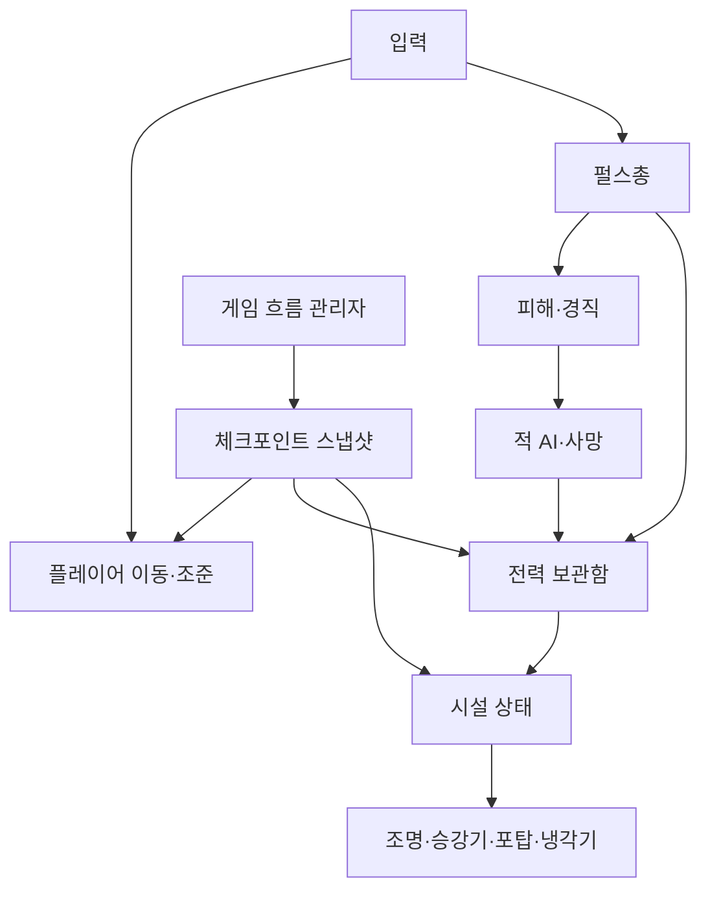

# BLACKOUT — 게임 기획서 / PRD

> 문서 상태: 기말 수직 조각 범위 확정안  
> 대상 버전: Unity 6000.3.22f1 · URP · Windows PC  
> 목표 플레이 시간: 10~15분

## 1. 한 문장

정전된 화물역에서 적과 시설 사이로 **전력 세 칸을 직접 옮겨**, 안전한 길과 위험한 전투를 스스로 만드는 3인칭 액션 게임이다.

## 2. 프로젝트 의의

재미있는 아이디어를 많이 붙이는 것보다 3D 게임 클라이언트의 기본 시스템을 끝까지 연결하는 것이 우선이다.

- Transform과 벡터를 사용하는 이동·회전
- 3인칭 카메라, 조준, 발사체와 충돌
- NavMesh와 상태 기반 적 AI
- Animator를 이용한 이동·공격·피격·사망
- 체력, 유한 자원, 상호작용, UI 피드백
- 게임 상태, 체크포인트, 실패 후 복원
- 조명·파티클·3D 사운드와 Windows 빌드

에셋은 외형을 제공하지만 위 동작과 규칙은 직접 구현한다.

## 3. 이야기와 세계

도시 전체가 정전된 밤, 자동화 화물역의 예비 전력이 관제탑에 고립됐다. 플레이어는 구조대나 군인이 아니라 시설을 실제로 다룰 수 있는 **도시 시설 관리 작업자**다. 휴대 장비에는 전력 세 칸만 저장할 수 있다.

정전 직전의 보안 명령이 끝나지 않아 경비 로봇은 사람을 침입자로 판단한다. 시설에 전력을 넣으면 조명과 승강기가 돌아오지만 같은 회로의 포탑과 보안 장치도 깨어난다. 따라서 “전력을 복구하면 무조건 좋아진다”가 아니라, 무엇을 켜고 무엇을 다시 끌지 결정해야 한다.

목표는 화물 승강기를 복구해 관제탑으로 올라가고, 오작동하는 경비 로봇을 정지시켜 예비 전력을 도시 송전망으로 돌리는 것이다.

## 4. 플레이어 경험 목표

1. 어두운 공간을 보고 “전력이 필요하다”고 이해한다.
2. 적을 쓰러뜨려 전력을 얻는다.
3. 전력을 시설에 주입해 공간이 실제로 바뀌는 것을 본다.
4. 켜진 시설이 새 위험도 만들었다는 사실을 체험한다.
5. 전력을 회수해 다시 상황을 바꾸고 자신만의 경로를 만든다.
6. 같은 규칙을 보스전에서 더 빠르고 압박감 있게 사용한다.

## 5. 핵심 규칙

### 5.1 전력

- 플레이어 보유 한도는 3칸이다.
- 일반 로봇은 사망 후 잔류 전력 1칸을 남긴다.
- 가까이 가서 0.7초 동안 흡수하면 한 칸을 얻는다. 피격되면 흡수가 취소된다.
- 시설은 1~2칸을 요구하며, 작동 중인 시설에서는 전력을 다시 회수할 수 있다.
- 회수 즉시 시설은 정전 상태로 돌아간다. 움직이는 승강기에서는 회수할 수 없다.
- 보유량이 꽉 찼으면 흡수할 수 없고 짧은 문구와 소리로 이유를 알려준다.

### 5.2 펄스총 한 자루

| 입력 | 결과 | 학습 목적 |
|---|---|---|
| 짧게 발사 | 빠른 기본 펄스, 일반 피해 | 발사체·충돌·피해 |
| 길게 눌렀다 발사 | 느리고 큰 충전 펄스, 경직·약점 피해 | 입력 시간·상태·VFX |
| 잔류 전력에 상호작용 | 전력 흡수 | 레이캐스트·취소 처리 |
| 시설 소켓에 상호작용 | 한 칸 주입 또는 회수 | 인터페이스·상태 변화 |

별도 무기, 탄약 종류, 인벤토리는 만들지 않는다.

### 5.3 전력으로 변하는 공간

| 시설 | 정전 | 전력 주입 | 전력 회수 |
|---|---|---|---|
| 작업등 회로 | 어둡고 적 식별이 어려움 | 전투 공간과 약점이 보임 | 다시 어두워져 은폐 가능 |
| 화물 승강기 | 위층 접근 불가 | 이동 가능, 운행 중 소음으로 적 경계 | 정차 후 회수하면 아래에 고정 |
| 보안 회로 | 포탑 정지 | 문이 열리지만 포탑도 활성화 | 문과 포탑 모두 다시 정지 |
| 보스 냉각기 | 보스 약점이 닫힘 | 냉각이 작동해 약점 노출 | 약점이 닫히고 전력을 되찾음 |

메뉴에서 선택만 하는 전력 배분은 금지한다. 플레이어가 소켓까지 이동하고, 위험을 감수해 직접 주입·회수하며, 공간·빛·소리·적 행동이 함께 바뀌어야 한다.

## 6. 전투 대상

### 6.1 추적 로봇

- 역할: 이동·NavMesh·상태 전환을 보여주는 기본 적
- 흐름: 순찰 → 소리/시야로 발견 → 추격 → 사거리 안 공격 → 수색 → 순찰
- 공격: 명확한 0.6초 예고 후 근거리 충격 또는 짧은 펄스
- 대응: 엄폐, 거리 유지, 충전 사격 경직
- 사망: 전력 한 칸 생성

### 6.2 고정 포탑

- 역할: 전력을 넣어 생긴 새로운 위험
- 흐름: 보안 회로 정전 시 완전 정지, 통전 시 탐색 → 조준선 → 연사
- 대응: 엄폐 사이 이동, 전력 회수로 비활성화, 측면 약점 사격
- 이동 애니메이션이 없어도 회전축·총열·발광 상태로 읽혀야 한다.

### 6.3 관제탑 경비 로봇 — 보스

보스만 별도의 새로운 규칙을 사용하지 않는다. 이전에 배운 전력 주입·회수와 충전 사격을 조합한다.

**1단계**

- 보스가 느린 직선 사격과 바닥 충격을 번갈아 사용한다.
- 경기장 양쪽 작업등을 켜면 공격 예고와 등 뒤 전력 코어가 잘 보인다.
- 켠 작업등의 회로는 동시에 포탑 하나를 깨운다.

**2단계**

- 체력 50%에서 보스가 과열되고 중앙 냉각기 소켓이 열린다.
- 전력 2칸을 냉각기에 넣으면 8초 동안 코어가 노출된다.
- 노출 중 충전 사격으로 큰 피해를 준다.
- 냉각 종료 후 전력을 회수해 다음 노출을 준비한다.
- 이 순환을 두 번 성공하면 처치 가능하다.

## 7. 10~15분 레벨 흐름

| 시간 | 구간 | 플레이 결과 |
|---:|---|---|
| 0~2분 | 정문·하역장 | 이동·조준, 꺼진 승강기와 첫 소켓 발견 |
| 2~5분 | 컨테이너 통로 | 추적 로봇 전투, 첫 전력 흡수 |
| 5~8분 | 보안 게이트 | 전력으로 문과 포탑이 동시에 켜지는 대가 학습 |
| 8~10분 | 화물 승강기 | 전력 2칸 확보, 체크포인트 저장, 1회 충전소 선택 |
| 10~15분 | 관제탑 | 2단계 보스, 승리 후 송전 복구 |

환경은 한 장면 안에서 연결한다. 로딩이나 장면 전환 없이 실패 후 가장 가까운 체크포인트로 복원한다.

## 8. 실패와 복원

- 플레이어 체력이 0이면 입력·AI 전투를 잠시 멈추고 실패 이유를 표시한다.
- 최근 체크포인트의 위치, 체력, 보유 전력, 시설 상태, 처치한 고정 조우를 복원한다.
- 보스 진입 직전 체크포인트는 자동 저장한다.
- 1회 충전소는 체력 회복과 전력 1칸 중 하나를 제공하고 사용 후 꺼진다.
- 저장 파일이나 여러 장면 영속화는 기말 범위가 아니다.

## 9. 시스템 책임 경계

한 스크립트가 모두 처리하지 않는다. 플레이어, 무기, 피해, 전력, 시설, AI, 게임 흐름이 이벤트와 작은 인터페이스로 연결되어야 한다.

## 10. 완료 기준

- 처음 보는 사람이 설명 없이 정전/통전 상태를 구분한다.
- 전력 주입과 회수로 최소 두 시설의 물리적 상태가 바뀐다.
- 추적 로봇과 포탑의 공격 예고·피격·사망 원인이 읽힌다.
- 사망 후 같은 장면에서 체크포인트 상태가 일관되게 복원된다.
- 보스가 2단계로 전환되고 전력 규칙을 사용해야만 약점을 공격할 수 있다.
- 시작부터 승리까지 10~15분 Windows 빌드를 오류 없이 플레이할 수 있다.
- README, 30~60초 핵심 영상, 에셋 출처표가 실제 구현과 일치한다.

## 11. 하지 않는 것

- 멀티플레이, 대화 선택지, 인벤토리, 제작, 절차 생성
- 여러 무기와 탄약, 스킬 트리, 장비 강화
- 5개 구역 전체와 구역 간 저장
- 감시 드론, 방패 유닛, 추가 보스
- 에셋 외형을 그대로 따라 새 3D 모델을 대량 제작하는 일

## 12. 가장 위험한 세 가지

1. **에셋 결합이 늦어지는 문제:** W07 이전에 환경·주인공·적 세트를 한 테스트 장면에서 검증한다.
2. **전력 규칙이 UI 버튼처럼 느껴지는 문제:** 모든 전력 조작은 월드 소켓, 이동 위험, 즉시 보이는 공간 변화가 있어야 한다.
3. **보스만 새 게임이 되는 문제:** 보스는 일반 구간의 전력·충전 사격·공격 예고만 재조합한다.

기말 이후 후보는 전력으로 지름길을 잠깐 여는 우회로, 적이 시설 전력을 훔치는 역상호작용, 둘 중 하나만 유지할 수 있는 양자택일 시설 순이다. 기말 필수 범위가 끝나기 전에는 착수하지 않는다.
