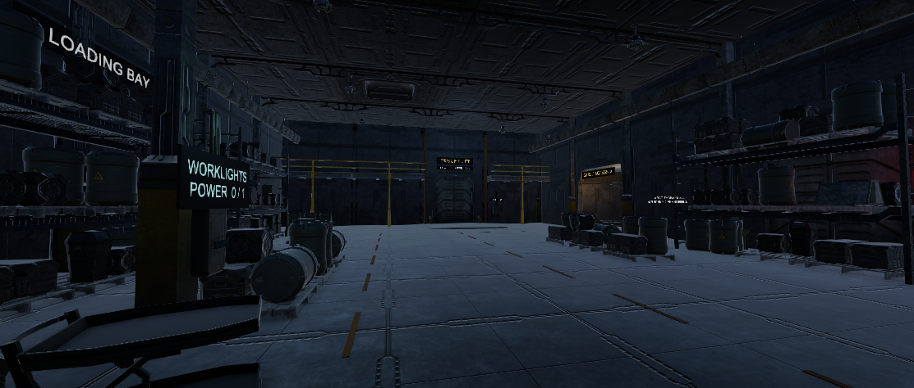
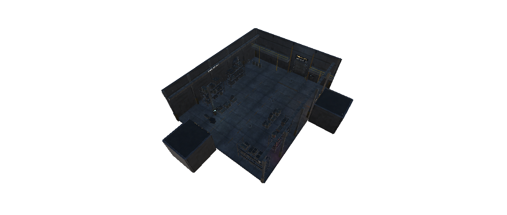

# BLACKOUT 인트로 하역장 — Unity MCP 제작 절차

작성: 2026-09-09. 대상: Unity 6000.3.22f1 / URP 17.3 / Windows.

## 목표와 현재 상태

`Assets/BLACKOUT/Scenes/Sandbox/testScene.unity`에 첫 0~2분 구간을 위한 환경 시제품을 생성·저장했다. 실제 플레이 시간 2분을 검증한 것은 아니다. 정전된 시설, 나중에 올라갈 승강기, 먼저 살펴볼 전력함을 공간만 보고 이해시키는 배치다. 이번 범위는 환경이며 전투·전력 시스템의 완성 구현은 포함하지 않는다.



위 이미지는 콘셉트 그림이 아니라, 설치된 에셋을 조립한 `testScene`의 실제 Unity 렌더 화면이다.

현재 PRD의 정문·하역장 → 화물 통로 → 보안 게이트 → 승강기 → 관제탑 흐름을 따른다. 첫눈에 보이는 승강기는 나중에 돌아올 목표이고, 첫 진입에서는 화물 통로로 이동한다. 입구에서 바로 관제탑으로 가는 지름길은 만들지 않는다.

## MCP로 가능한 일과 사람이 판단해야 하는 일

Unity MCP는 특정 경로에서 프리팹을 찾고, 내부 오브젝트·컴포넌트를 읽고, 원본과 연결된 인스턴스를 배치하고, 재질·조명·카메라를 조정할 수 있다. 다각도 렌더 화면을 얻어 결과를 다시 수정할 수도 있다. 하지만 이름이 같다고 부품이 맞물리는 것은 아니며, 보기 좋은 화면 한 장만으로 통행이나 게임 카메라까지 검증되지는 않는다.

이 프로젝트에서는 **원본 정보 → 측정 → 실제 화면 → 제한된 배치 → 재검수**를 반복한다. 많은 오브젝트를 한 번에 생성한 성공 메시지는 완료 기준이 아니다.

## 특정 프리팹을 실제로 이해하는 절차

1. 검색 범위를 `Assets/ThirdParty/SciFi Warehouse Kit/Prefabs`로 고정한다. 정확한 경로와 GUID를 저장한다.
2. 프리팹마다 메시 외곽 크기, 기준점, 정면 방향, 자식 오브젝트, 재질·셰이더, 충돌체, 포함된 스크립트·조명·오디오를 기록한다. 합쳐진 선반은 자식 변환까지 계산해야 한다.
3. 원본 밝기의 검수용 조명에서 앞·뒤·옆·위와 사선 화면을 본다. 크기 기준인 1m 물체와 비교하고, 벽은 안쪽 면과 바깥쪽 면을 따로 본다.
4. 바닥 2장 + 벽 2장 + 모서리 + 문으로 한 구획을 시험한다. 모서리 기준점 때문에 생기는 틈, 벽 반전, 겹치는 바닥, 문을 막는 충돌체를 확인한다.
5. 합격한 부품만 배치표에 넣는다. 표에는 원본 경로, 인스턴스 이름, 위치, 회전, 크기, 용도, 예상 차지 면적이 있어야 한다.
6. 바닥·벽 → 주요 시설 → 화물 → 조명 순서로 작은 묶음을 적용한다. MCP 배치는 중간 실패 시 자동으로 되돌아가지 않으므로 결과 수와 실제 계층을 매번 비교한다.
7. 플레이어 눈높이와 어깨 뒤 카메라, 위에서 보는 화면으로 재검수한다. 어두운 연출 전에 밝은 조명에서 틈과 부유물을 먼저 찾는다.

## 이미 확인한 원본 수치

다음 표는 첫 단계에서 설치 파일의 충돌체를 읽어 확인한 수치다. 이후 Unity MCP로 연결하여 후보 28개의 메시 외곽과 실제 렌더도 별도로 검수했다. 충돌체 수치와 메시 수치가 다른 이유를 숨기지 않기 위해 둘을 구분한다.

| 원본 경로 (`Prefabs/` 기준) | 확인 내용 | 배치에 주는 의미 |
|---|---|---|
| `Structures/Floor/Floor Tile 01.prefab` | 6 × 0.25 × 6m, 중심 (3, -0.125, 3) | 기준점은 모서리, 표면 높이는 0m. 6m 간격으로 배치 |
| `Structures/Walls/Wall Plain.prefab` | 두께 0.3m, 높이 9m, 폭 6m, 폭 방향은 로컬 Z | 바닥과 같은 방향으로 놓는다고 벽이 자동으로 맞지 않음 |
| `Structures/Walls/Wall Corridor.prefab` | 문 통로용 개구부와 분리된 충돌체 | 출입구 후보. 실제 유효 폭과 카메라 통과를 측정 |
| `Structures/Walls/Wall BayDoor.prefab` | 벽 전체 크기 충돌체가 포함됨 | 닫힌 화물문 연출에는 적합. 실제 개폐 문으로 쓰려면 충돌 처리 검증 필요 |
| `Structures/Structure Props/Fusebox 01.prefab` | 높이 약 0.97m, 폭 약 0.52m, 원점 아래로 내려오는 형태 | 위치값을 손 높이로 넣으면 함이 너무 낮아질 수 있음 |
| `Props/Crates Barrels Pallets/Pallet.prefab` | 약 1.56 × 0.20 × 1.52m | 바닥에 붙여 배치. 위 화물의 바닥은 약 0.2m |
| `Props/Crates Barrels Pallets/Crate Long.prefab` | 약 0.64 × 0.60 × 1.27m | 실제 소형 상자이며 컨테이너처럼 크게 늘리지 않음 |
| `Props/Shelves/Shelf Variation 01.prefab` | 여러 자식과 각기 다른 충돌체 포함 | 이름/루트 위치만으로 배치하지 않고 전체 외곽을 측정 |

바닥 원본은 URP 셰이더를 사용하는 상태로 확인됐다. 모든 재질의 정상 렌더가 검증됐다는 뜻은 아니다.

Unity에서 추가로 확인한 차이는 다음과 같다.

- `Wall Plain`: 메시 전체 높이는 약 10m이며 아래 1m는 바닥 아래로 내려간다. 따라서 메시 최하단을 바닥 높이에 맞추면 벽이 1m 떠오른다. 원본 기준점 Y=0을 유지했다.
- `Catwalk Long`: 원점 Y=0일 때 발판 표면이 이미 Y=4.5m에 있다. 발판을 4.5m 더 올리면 이중으로 상승한다.
- `Catwalk Long Rails`: 난간과 아래 지지대까지 포함돼 총 높이가 약 5.46m다.
- `Fusebox 01`: 상자만 약 0.97m지만 배관까지 포함한 메시 높이는 약 2.24m다. 배관을 손 높이로 오인하지 않았다.
- `Shelf Variation 01`: 실제 메시 외곽은 약 6.27 × 5.03 × 1.95m다. 자식까지 포함한 외곽의 바닥·가로 중심을 기준으로 배치했다.
- 검수 후보 28개에서 재질이 모두 `Universal Render Pipeline/Lit`으로 확인됐으며 미리보기에서 분홍색 오류가 없었다. 이후 출입구 마감용 `Corridor Deadend`를 추가하고 씬 렌더로 확인했다.

[후보 28개 실제 미리보기](../images/production/intro/prefab-contact-sheet.png) · [정확한 경로·GUID·크기·재질·충돌체 기록](../images/production/intro/prefab-audit.json)

## 인트로 장소 기획

장소는 **정전으로 작업이 멈춘 화물역 하역장**이다. 시설 관리자가 직원 출입구로 들어오고, 반쯤 남겨진 하역 작업 사이로 멈춘 승강기와 분전함을 본다. 가지런한 운반 단위, 정차한 카트, 비어 있는 중앙 통로로 '원래 작동하던 장소'임을 보여준다.

기본 공간은 24 × 30m, 천장 높이는 키트 규격인 9m를 출발점으로 삼는다. 6m 모듈의 구조는 유지하되, 화물 배치로 실제 이동로와 가까운 볼거리를 만든다. 이 치수는 초안이며 첫 카메라 검수 후 줄일 수 있다.

| 구역 | 기능 | 주요 에셋 | 구성 원칙 |
|---|---|---|---|
| 직원 진입부 | 안전하게 조작과 시야 익히기 | Corridor Passthrough, Wall Corridor, Exit Sign | 정면에 다음 목적지가 보이며 뒤는 직원용 출입구 |
| 하역장 첫 전망 | 꺼진 승강기와 수직 목표 제시 | Floor Tile, Pillar, Catwalk, Wall BayDoor | 중앙 통로를 비우고 시설을 한눈에 읽게 함 |
| 전력 점검 지점 | 첫 소켓 발견 위치 | Fusebox 01, Pipes, Wall Light | 손이 닿는 높이, 가까운 정지 설비와 시각적으로 연결 |
| 중단된 작업 | 시설의 용도와 사람의 부재 표현 | Pallet Variation, Cart, Shelf Variation, Barrel | 작업별로 묶고 출입문 앞은 비움. 무작위 장식 금지 |
| 화물 통로 출구 | 다음 전투 구간으로 유도 | Wall Corridor, Shelves, 작업등 | 가장 밝은 통행 가능 개구부. 인트로에서 실내를 무한히 확장하지 않음 |


색은 차콜·회색 금속을 기본으로, 황색은 작업 경계에, 청록은 전력 조작 지점에, 적색은 제한된 비상등에 사용한다. 길이 읽히는 낮은 청회색 환경광을 유지한다. 폐허·외계 시설·대량의 발광 장식은 이 인트로의 목표가 아니다.

## 실제 적용 방식

- 씬 이름은 `testScene`으로 고정하고 `BLACKOUT_Intro` 루트 아래 구조·화물·시설·조명·검수 카메라를 묶는다.
- 프리팹 원본은 유지하고 씬 인스턴스와 프로젝트 전용 재질로 조정한다.
- 일반 부품은 스케일 1을 우선한다. 모서리 기준점은 측정된 오프셋으로 맞추고 작은 소품을 건축물 크기로 늘리지 않는다.
- 화물 승강기는 기존 발판·난간·기둥을 조립한 정지 환경 시제품이다. 전력·승강 동작이 구현됐다고 표시하지 않는다.
- 생성 도구를 쓰더라도 결과는 일반 Unity 오브젝트와 프리팹 인스턴스여야 하며, 사용자가 Hierarchy에서 이동·수정할 수 있어야 한다.
- 기존 씬의 저장되지 않은 작업이 있으면 닫거나 덮어쓰지 않는다. 새 씬 저장과 기존 씬 교체를 분리한다.

실제 적용에는 공식 Unity MCP v10.0.0의 로컬 서버 명령을 사용했다. `get_editor_state`와 `get_project_info`로 프로젝트·컴파일 상태를 확인하고, `manage_prefabs`로 원본을 조회했다. 반복 측정·최초 조립은 작은 편집기 도구를 `execute_menu_item`으로 실행했으며, 후속 끝벽·조명·표지판 수정은 `batch_execute`, `manage_gameobject`, `manage_components`, `manage_material`로 적용했다. 화면은 `manage_camera`, 저장과 실행 검사는 `manage_scene`, `manage_editor`, `read_console`로 확인했다.

`execute_code`는 이 환경에서 CodeDOM 컴파일 오류를 반환했으므로 사용하지 않았다. 디스크에 저장하고 Unity가 정상 컴파일한 Editor 도구를 호출하는 경로로 작업했다.

### 남겨 둔 편집기 도구

위치는 `Assets/BLACKOUT/Scripts/Editor/`다. 게임 실행 파일에는 들어가지 않는 제작 보조 코드다.

| 파일 | 책임 | 입력·출력과 실패 처리 |
|---|---|---|
| `BlackoutMcpSession.cs` | BLACKOUT 편집기를 로컬 MCP 서버에 연결 | 포트 8081로 연결. 실패하면 Console 안내, 씬 변경 없음 |
| `BlackoutIntroAudit.cs` | 정해진 후보를 실제로 측정·렌더 | `Audit()` → Library의 JSON/PNG. 없는 경로면 중단 |
| `BlackoutIntroBuilder.cs` | 원본 프리팹과 프로젝트용 재질로 최초 씬 조립 | `Build()` → testScene. 이미 있는 testScene 또는 저장되지 않은 씬이 있으면 중단 |
| `BlackoutIntroVerification.cs` | 경로·누락 파일 검증과 검수 화면 생성 | `Validate()` → 결과 JSON. `CapturePlan()` → 단면 이미지 후 지붕·벽 복원 |

Unity 메뉴 `BLACKOUT → Intro`에 검수·생성·검증 메뉴가 있다. 이미 만든 씬은 `2 Build testScene`으로 덮어쓰지 않는다. Hierarchy의 프리팹 인스턴스를 직접 수정하거나 MCP로 수정한 뒤 `3 Validate Environment`로 다시 검사한다.

같은 절차를 다음 공간에 적용할 때는 아래 순서를 유지한다.

```text
후보 경로와 크기 읽기 → 밝은 미리보기로 형태 확인
→ 모듈의 기준점을 반영한 배치표 작성
→ 작은 구획 조립 → 카메라로 보기 → 수정
→ 전체 조립 → 길과 바닥 검사 → 저장·실행 화면 확인
```

씬은 `BLACKOUT_Intro` 루트 아래 일반 오브젝트와 원본에 연결된 프리팹 인스턴스로 저장됐다. 플레이할 때 생성 도구가 씬을 다시 만드는 구조가 아니다.

## 완료 판정

1. `testScene.unity`가 실제로 저장되어 다시 열리고, 원본 프리팹 연결이 남아 있다.
2. 바닥 접합부·벽의 앞뒤·천장·문 개구부를 실제 렌더 화면에서 확인했다.
3. 주요 이동로 약 3m 이상, 점검 지점 앞 약 2m 이상의 여유를 확인했다. 카메라와 충돌체로 추가 검증한다.
4. 시작 시점에서 승강기 목표가 보이고, 첫 분전함과 통행 가능한 출구를 구분할 수 있다.
5. 새 컴파일 오류와 누락된 재질·스크립트가 없고, 주요 경로의 바닥 충돌이 연속적이다.
6. 실제 인게임 높이·상부·측면 렌더 화면과 측정 결과를 남겼다.

이 환경 단계만으로 전투 가능, TPS 이동 완료, 전력 주입 동작 완료, 60fps 보장을 선언하지 않는다. 해당 시스템을 연결한 뒤 다시 검사한다.

## 실제 검증 결과

2026-09-09 생성본:

| 검사 | 결과 |
|---|---|
| 파일 저장·다시 열기 | `testScene.unity` 저장 후 다시 열어 동일 검증 통과 |
| 사용 원본 / 프리팹 인스턴스 | 24종 / 139개 |
| Renderer / 활성 충돌체 / 참조 재질 | 391 / 285 / 27 |
| 실시간 조명 / 그림자 조명 | 7 / 1 |
| 주요 동선의 바닥 샘플 | 113지점 통과 |
| 반지름 0.35m, 상단 약 1.85m 사람 크기 통로 검사 | 8개 구간 통과 |
| 누락 스크립트 / 재질 | 0 / 0 |
| 새 컴파일 오류·경고 및 짧은 Play Mode 렌더 검사 | 확인 시 0건 |

수치는 이 정적 환경과 정의된 동선의 결과다. 모든 위치의 충돌이나 실제 TPS 카메라, 실제 플레이어 조작, 성능을 증명하지 않는다. 현재 플레이어 이동 코드는 연결하지 않았다.



단면 이미지는 내부 배치를 보려고 촬영 시에만 지붕과 일부 벽을 숨겼다. 저장된 씬에는 지붕과 벽이 복원돼 있다.

검수 후 반영한 수정:

- 입구 뒤와 다음 구역 통로 끝에 보이던 빈 배경을 같은 키트의 끝벽으로 마감했다.
- 오른쪽 화물 통로는 따뜻한 보조등으로, 승강기는 차가운 약한 빛으로 구분했다.
- 실제 통전 전 작업등의 발광을 껐고, 전력함의 표시와 공간을 읽기 위한 최소 조명을 남겼다.
- 카메라에 후처리 기반 가장자리 보정을 켰다.

남은 개선점은 중앙 하역장 바닥 반복감, 원거리 작은 표지판의 가독성, 승강기 상부 갤러리의 다음 구역 연결이다. 먼저 TPS 카메라와 실제 조작을 붙인 뒤 이동 폭과 목표 시야를 확인해야 한다. 현재의 정지 승강기를 실제 승강기로 연결할 때는 원본 벽 전체 충돌체가 경로를 막지 않도록 별도 처리해야 한다.

[기계 검증 결과](../images/production/intro/scene-validation.json)

[전력함 근접 화면](../images/production/intro/intro-power-station.png) · [다음 구역 출구 화면](../images/production/intro/intro-cargo-exit.png)

스크린샷 도구가 성공을 반환해도 파일 크기와 실제 이미지를 열어 확인해야 한다. 이 세션에서도 씬을 다시 연 직후의 기본 카메라 캡처 한 장은 매우 작은 이미지로 나와 증거에서 제외했고, 정상적인 Play Mode 캡처와 위치 지정 캡처를 사용했다.

## 조사 근거

- [MCP for Unity 공식 프로젝트](https://github.com/CoplayDev/unity-mcp): 편집기 연결, 설치 버전과 공식 패키지 경로.
- [공식 에셋·프리팹 작업 예시](https://github.com/CoplayDev/unity-mcp/blob/beta/unity-mcp-skill/references/workflows.md): 검색 범위 지정, 프리팹 정보 조회와 원본 경로 기반 인스턴스 생성.
- [공식 도구 설명](https://coplaydev.github.io/unity-mcp/reference/tools): 씬·프리팹·카메라·조명 도구.
- 프로젝트 [게임 기획서](../planning/BLACKOUT_PRD.md), [아트 바이블](../art-direction/BLACKOUT_ArtBible.md), 설치된 SciFi Warehouse Kit 프리팹·재질 파일.

설치 대상은 v10.0.0으로 고정한다. 온라인 beta 예시는 실제 설치 버전의 스키마와 일치하는지 확인 후 사용한다.
