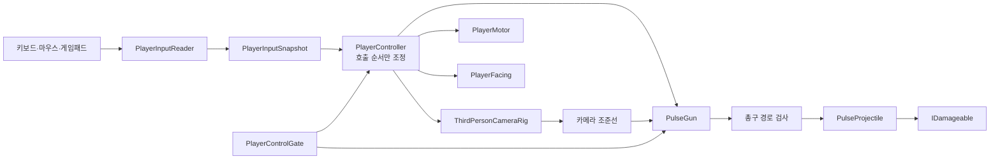
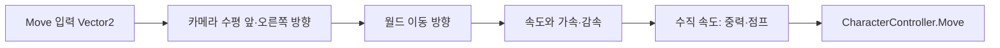
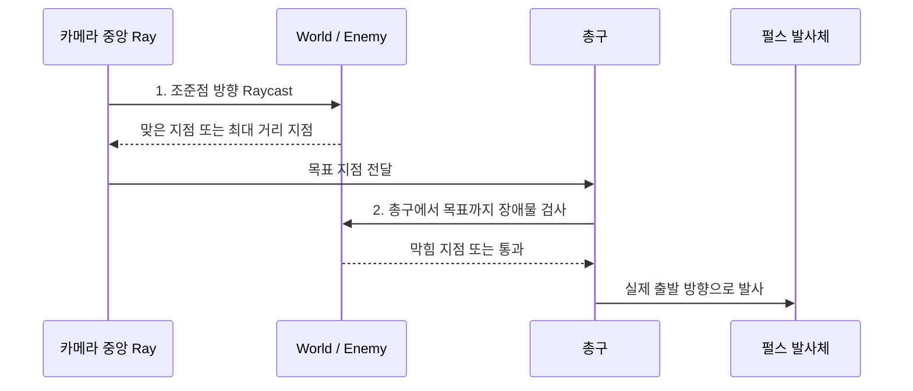

# BLACKOUT — TPS 플레이어 이동·조준·펄스 발사 구현 가이드

플레이어가 키를 누르면 움직이고 클릭하면 발사되는 것만으로는 TPS가 완성되지 않는다. 조준 중 벽 뒤를 맞히거나, 사망 뒤에도 발사되거나, 카메라를 바꾸자 이동 코드가 깨지는 문제를 피하려면 **입력, 이동 규칙, 카메라, 무기, 발사체를 서로 다른 책임으로 나눠야 한다.**

이 문서는 BLACKOUT의 W02에서 이동·점프·TPS 카메라·조준·기본 펄스 발사를 처음 연결하기 위한 혼합형 문서다. 최소 동작부터 시작하지만, 이후 애니메이션·피격·전력·적 AI·체크포인트를 붙일 수 있는 방향으로 설계한다.

> 대상: Unity 6000.3.22f1 · URP 17.3.0 · Windows PC  
> 현재 상태: Input System 1.20.0은 설치되어 있으나, 프로젝트의 `Player.cs`에는 아직 동작이 구현되어 있지 않다. Cinemachine은 현재 직접 의존성에 없다.  
> 이 문서의 상태: 구현 계획과 학습 가이드. 아래 코드·수치는 아직 프로젝트에 적용된 결과가 아니다.

## 1. 이번 구현의 목표

### 플레이어가 확인할 결과

1. `WASD` 또는 방향키로 카메라가 보는 방향을 기준으로 이동한다. 대각선은 직선보다 빠르지 않다.
2. 마우스로 카메라를 돌리고, 벽 가까이에서는 카메라가 벽을 통과하지 않는다.
3. 점프·착지·경사·벽 모서리에서 이동이 예측 가능하다.
4. 우클릭 조준 중에는 캐릭터가 카메라 수평 방향을 보고, 좌클릭은 기본 펄스를 한 번 발사한다.
5. 조준점이 적을 가리켜도 총구 앞에 벽이 있으면 벽에 맞는다. 벽 뒤 적을 맞히지 않는다.
6. `Gameplay` 입력을 끄면 이동·조준·발사가 함께 멈춘다. 나중의 사망·메뉴·컷신이 이 규칙을 사용한다.

### 완료 기준

- `testScene`의 통로·엄폐물·벽 모서리에서 위 동작을 직접 확인한다.
- 발사체가 한 번만 충돌하고, 벽 또는 표적에 맞은 뒤 제거된다.
- Console에 새 오류가 없고, Play Mode를 다시 시작해도 입력 구독·발사가 중복되지 않는다.
- Windows Development Build에서 같은 동작을 확인하고, 측정 환경과 첫 Profiler 기록을 남긴다.

## 2. 왜 `Player.cs` 한 파일에 모두 넣지 않는가

아래처럼 한 스크립트에 `Keyboard.current`, `transform.Translate`, 카메라 회전, Raycast, Instantiate, 피해 계산을 모두 넣으면 첫날에는 빨라 보인다. 하지만 기능 하나가 바뀔 때마다 다른 기능도 함께 위험해진다.

| 이후에 생길 요구 | 한 파일 구조의 문제 | 이 문서의 대응 |
|---|---|---|
| 키 재지정·게임패드 | 코드가 특정 키와 장치 이름에 묶인다 | 입력 행동(Action)과 실제 장치 바인딩을 분리한다 |
| 사망·메뉴·컷신 | 여러 `if (isDead)`가 이동·총·카메라에 흩어진다 | 하나의 제어 권한이 어떤 행동을 허용할지 결정한다 |
| 조준 애니메이션 | 이동 코드가 Animator·총·카메라를 모두 알아야 한다 | 이동, 방향 전환, 무기, 표시가 각자 필요한 정보만 받는다 |
| 충전 사격·전력 흡수 | `Update`의 조건문이 상태 조합으로 커진다 | 무기가 입력 요청을 받고 자기 상태와 재사용 시간을 관리한다 |
| 총구 앞 벽 | 카메라 Raycast만 쓰면 시각과 실제 총구가 어긋난다 | 카메라 목표 결정과 총구 경로 검사를 두 단계로 한다 |
| 성능 문제 | 어느 기능이 프레임 비용을 만들었는지 찾기 어렵다 | 컴포넌트 경계와 `ProfilerMarker`를 기준으로 측정한다 |

이것은 클래스 수를 많이 만들자는 뜻이 아니다. **변경 이유가 다른 코드는 분리하고, 함께 바뀌는 코드는 가까이 둔다**는 원칙이다. 이동 규칙을 바꾸는 일과 발사체 충돌 규칙을 바꾸는 일은 보통 함께 일어나지 않는다.

## 3. 현업에서 자주 보이는 방식과 이번 선택

회사·장르·엔진마다 구현은 다르다. 아래 방식은 “모든 현업이 반드시 같은 클래스를 쓴다”는 표준이 아니라, 상용 Unity 게임에서도 매우 자주 쓰이는 문제 해결 방향이다.

| 방식 | 이번 적용 | 좋은 이유 | 주의할 점 |
|---|---|---|---|
| Input Action Map | `Gameplay`, `UI` 행동을 분리 | 장치 교체·키 재지정·입력 차단이 쉬워진다 | 입력 행동을 너무 잘게 쪼개면 관리가 어려워진다 |
| 컴포넌트 조합 | Motor, Facing, Combat, Camera를 별도 컴포넌트로 둔다 | 변경 범위와 테스트 범위가 작아진다 | 모든 일을 인터페이스로 감추면 흐름을 따라가기 어려워진다 |
| 얇은 조정자 | `PlayerController`가 한 프레임의 호출 순서만 정한다 | `Update` 순서를 명시해 카메라·이동·발사의 흔들림을 줄인다 | 조정자에 규칙을 몰아넣으면 다시 거대 클래스가 된다 |
| ScriptableObject 설정 | 이동 속도·점프 높이·연사 간격을 설정 에셋으로 둔다 | 코드 수정 없이 수치를 비교하고 프리팹 간 설정을 재사용한다 | 현재 체력·현재 쿨다운 같은 실행 상태를 넣으면 공유 버그가 생긴다 |
| 명시적 Inspector 참조 | 같은 프리팹 안의 협력 컴포넌트를 연결한다 | 실행 순서와 의존 관계가 눈에 보인다 | 전역 `Find`와 거대한 싱글턴으로 참조를 숨기지 않는다 |
| 인터페이스·좁은 이벤트 | `IDamageable`처럼 역할이 분명한 경계에 사용한다 | 발사체가 적 종류를 몰라도 피해를 전달한다 | 모든 신호를 전역 이벤트 버스로 보내면 추적이 어려워진다 |
| 충돌 레이어 표 | Player, PlayerProjectile, Enemy, World, CameraObstacle를 구분 | 카메라·시야·발사체가 서로 다른 대상을 검사한다 | 레이어 이름만 만들고 Collision Matrix를 확인하지 않으면 효과가 없다 |
| Object Pool | 발사체·명중 효과가 실제로 반복된 뒤 도입한다 | 생성·제거로 인한 할당과 끊김을 줄일 수 있다 | W02부터 무조건 넣지 않는다. 먼저 정상 수명·충돌을 만든다 |

Unity Input System의 Action은 입력의 **의미**와 실제 장치 조작을 분리한다. 그래서 `Move`라는 행동에 키보드와 게임패드를 함께 연결하고, 코드는 특정 키 대신 행동을 읽는다. [Input System 1.20 공식 문서](https://docs.unity3d.com/Packages/com.unity.inputsystem@1.20/manual/Actions.html)

## 4. 이번 구조의 전체 그림



### 4.1 한 프레임의 책임과 순서

1. `PlayerInputReader`는 Input System 콜백을 받아 이동·시선·버튼 상태를 **캐시**한다.
2. `PlayerController`는 조작 가능 여부를 확인하고, 현재 입력 묶음 `PlayerInputSnapshot`을 만든다.
3. 카메라가 시선을 먼저 반영해 이번 프레임의 수평 앞·오른쪽 방향과 조준선을 제공한다.
4. `PlayerMotor`가 카메라 수평 방향을 기준으로 이동·중력·점프를 계산한다.
5. `PlayerFacing`이 비조준 때는 이동 방향, 조준 때는 카메라 수평 방향을 향해 캐릭터 몸을 돌린다.
6. `PulseGun`이 눌림 요청·재사용 시간·제어 권한을 검사한다. 발사 가능하면 카메라 목표와 총구 경로를 계산해 발사체에 넘긴다.
7. 카메라 실제 위치와 벽 충돌 보정은 `LateUpdate`에서 수행한다. 발사체의 일정 속도 이동·충돌 검사는 `FixedUpdate`에서 수행한다.

`PlayerController`는 직접 이동량을 계산하거나 탄환을 만들지 않는다. 이 컴포넌트의 일은 **호출 순서를 읽기 좋게 한곳에 적는 것**이다. 이 정도의 조정자는 실무에서 흔히 쓰는 Composition Root 또는 Facade와 비슷한 역할을 한다.

## 5. 적용 범위와 보류할 것

| 지금 적용 | 이유 |
|---|---|
| CharacterController 기반 이동, 수동 중력·점프 | TPS 캐릭터에 필요한 반응성과 제어를 빠르게 확보한다 |
| Input Actions와 `Gameplay`/`UI` 분리 | 사망·메뉴·키 재지정을 대비하는 기본 경계다 |
| 카메라 기준 이동, 조준 중 몸 방향 고정 | TPS의 기본 조작 감각과 애니메이션 연결에 필요하다 |
| 카메라 목표 + 총구 장애물의 2단계 검사 | 조준점과 실제 발사 결과의 불일치를 초기에 해결한다 |
| 충돌을 한 번만 처리하는 펄스 발사체 | W03의 피해·명중·풀링으로 확장할 수 있다 |
| ScriptableObject 설정, Layer 표, 개발용 Gizmo | 수치 조정과 오류 재현을 초기에 편하게 한다 |

| 나중에 도입 | 지금 보류하는 이유 |
|---|---|
| Object Pool | 발사체 수명과 충돌 규칙을 먼저 정확히 만든 뒤 측정한다 |
| Animator Blend Tree·상체 Layer·Animation Rigging | 이동과 조준 방향의 실제 요구를 확인한 후 연결한다 |
| Cinemachine | 널리 쓰이는 패키지지만 설치 자체가 카메라 품질을 보장하지 않는다. 먼저 카메라 축·충돌·목표 원리를 이해하고 비교한다 |
| Jobs·Burst·ECS | W02의 플레이어 한 명에는 복잡성 대비 이득이 작다. 실제 CPU 병목과 다수 적 요구가 생긴 뒤 실험한다 |
| 네트워크 예측·보정 | 싱글플레이에 필요하지 않다. 온라인 실험은 별도 목표로 다룬다 |

`CharacterController`는 힘과 질량으로 움직이는 물체가 아니라, 충돌 제약 안에서 캐릭터 이동을 직접 제어할 때 적합한 Unity 컴포넌트다. 따라서 중력·점프·이동 발판 처리는 직접 설계해야 한다. [Unity 6.3 Character Controller 문서](https://docs.unity3d.com/6000.3/Documentation/Manual/class-CharacterController.html)

## 6. 파일·프리팹 책임

발사체를 실제로 만들기 시작하는 시점이므로 기존 폴더 원칙에 따라 `Combat`, `Prefabs/Weapons`, `Prefabs/Projectiles`, `Data/Player`, `Data/Weapons`를 추가한다. 빈 폴더를 미리 만드는 것이 아니라 이번 기능에 필요한 항목만 만든다.

```text
Assets/BLACKOUT/
├─ Data/
│  ├─ Player/
│  │  └─ PlayerMovementConfig.asset
│  └─ Weapons/
│     └─ PulseGunConfig.asset
├─ Prefabs/
│  ├─ Characters/Player_Striker14.prefab
│  ├─ Weapons/PulseGun.prefab
│  └─ Projectiles/PulseProjectile.prefab
├─ Settings/BlackoutInputActions.inputactions
└─ Scripts/Runtime/
   ├─ Gameplay/
   │  ├─ Player/
   │  │  ├─ PlayerController.cs
   │  │  ├─ PlayerInputReader.cs
   │  │  ├─ PlayerMotor.cs
   │  │  ├─ PlayerFacing.cs
   │  │  └─ PlayerControlGate.cs
   │  └─ Combat/
   │     ├─ PulseGun.cs
   │     ├─ PulseProjectile.cs
   │     └─ IDamageable.cs
   └─ Presentation/Camera/
      └─ ThirdPersonCameraRig.cs
```

| 파일 | 책임 | 알면 안 되는 것 |
|---|---|---|
| `PlayerInputReader` | Action 콜백을 현재 입력 묶음으로 바꾼다 | 이동 속도, 무기 위력, 피해 대상 |
| `PlayerController` | 호출 순서와 제어 권한을 조정한다 | 중력 공식, Projectile 충돌 세부 |
| `PlayerMotor` | 이동 방향, 중력, 점프, CharacterController 이동 | 키보드 키, 카메라 충돌, 피해 계산 |
| `PlayerFacing` | 이동·조준 상태에 맞는 몸 방향을 만든다 | 탄환 생성, UI |
| `ThirdPersonCameraRig` | 시선 축, 카메라 위치, 벽 회피, 조준 Ray 제공 | 플레이어 체력, 발사 쿨다운 |
| `PulseGun` | 발사 가능 여부, 총구 방향·장애물 검사, 발사 요청 | 키보드 장치, 적의 구체적 클래스 |
| `PulseProjectile` | 일정 속도 이동, 한 번의 충돌, 피해 전달·종료 | 플레이어 입력, 카메라 회전 |
| `IDamageable` | 피해를 받을 수 있는 대상의 최소 약속 | 로봇 AI, 체력 UI, 발사체 구현 |
| `*Config` | 조정 가능한 **설정 값** | 현재 속도, 현재 점프 중 여부, 현재 쿨다운 |

### 6.1 플레이어 프리팹 계층

```text
Player_Root                         ← CharacterController, PlayerController, Motor, Facing, InputReader
├─ Visual_Root                      ← Striker14 모델과 이후 Animator
├─ Camera_Target                    ← 카메라가 따라갈 높이 기준점
├─ Weapon_Socket_R                  ← 오른손 또는 임시 무기 장착점
│  └─ PulseGun
│     └─ Muzzle                     ← 총구 Transform
└─ Debug                            ← Gizmo와 개발 표시 전용

Main Camera
└─ ThirdPersonCameraRig             ← Follow: Camera_Target, Camera: Main Camera
```

외부 Striker14 원본 모델에는 직접 코드를 붙이지 않는다. `Player_Root` 프리팹이 모델을 자식으로 참조해야 원본 재가져오기와 게임 설정 변경이 분리된다.

## 7. 입력 설계: 장치를 읽지 말고 의도를 읽는다

Unity Input Actions Editor에서 `Gameplay` Map과 Move·Look·Jump·Aim·Fire·Interact를 실제로 만드는 클릭 순서는 [Input Actions 설정 따라 하기](BLACKOUT_InputActionsSetup.md)에 정리했다. 먼저 이 설정을 마친 뒤 아래 Reader 구조를 구현한다.

### 7.1 `BlackoutInputActions` 권장 구성

| Map | Action | 형식 | 초기 바인딩 | BLACKOUT에서의 의미 |
|---|---|---|---|---|
| Gameplay | Move | `Value / Vector2` | WASD, 방향키, Gamepad Left Stick | 이동 의도 |
| Gameplay | Look | `Value / Vector2` | Mouse Delta, Gamepad Right Stick | 시선 변화 |
| Gameplay | Jump | `Button` | Space, Gamepad South | 점프 시작 요청 |
| Gameplay | Aim | `Button` | Mouse Right Button, Gamepad Left Trigger | 조준 유지 |
| Gameplay | Fire | `Button` | Mouse Left Button, Gamepad Right Trigger | 기본 발사 요청 |
| Gameplay | Interact | `Button` | E, Gamepad West | 이후 전력 흡수·주입 |
| UI | Navigate, Submit, Cancel | UI 기본 행동 | 키보드·게임패드 | 메뉴 조작 |

`Move`는 2D Vector Composite를 사용한다. 대각선 입력은 `(1, 1)`처럼 길이가 1보다 커질 수 있으므로, `PlayerMotor`에서 크기를 최대 1로 제한한다. 입력 에셋의 값만 믿고 속도를 곱하면 대각선이 약 1.41배 빨라질 수 있다.

### 7.2 입력 Reader의 최소 형태

아래 구조는 완성 코드가 아니라 책임의 모양이다. 생성된 입력 클래스의 정확한 이름은 실제 `.inputactions` 파일을 만든 뒤 결정한다.

```csharp
public readonly struct PlayerInputSnapshot
{
    public Vector2 Move { get; }
    public Vector2 Look { get; }
    public bool IsAiming { get; }
    public bool JumpPressed { get; }
    public bool FirePressed { get; }
}

// PlayerInputReader의 책임 예시
// Action callback: 이동·시선은 최신 값을 저장한다.
// Button callback: Jump·Fire는 한 프레임 소비할 요청으로 저장한다.
// CaptureSnapshot(): 요청을 한 번 전달한 뒤 다음 프레임을 위해 비운다.
```

여기서 `FirePressed`를 버튼이 눌린 그 순간에 한 번 기록하는 이유는, 무기 코드가 프레임의 정확한 시점에 입력을 소비하도록 하기 위해서다. 나중에 충전 사격에는 `FireStarted`, `FireCanceled`, 누른 시간을 별도로 저장한다. `PulseGun`이 Input System 콜백을 직접 구독하면 무기 교체·메뉴·입력 해제에서 수명 관리가 복잡해진다.

**입력 손실과 중복을 확인할 질문**

- 메뉴를 연 프레임에 남은 `FirePressed`가 게임으로 넘어가지는 않는가?
- Alt+Tab 뒤 마우스 버튼이 눌린 상태로 남았다고 오해하지 않는가?
- `OnEnable` 때마다 같은 콜백을 중복 등록하지 않는가?
- 마우스 Delta와 게임패드 Stick에 같은 `deltaTime` 보정을 적용해도 되는가?

## 8. 이동·회전·점프 설계

### 8.1 CharacterController를 선택하는 이유

| 비교 | CharacterController | Rigidbody |
|---|---|---|
| 주 용도 | 반응성 있는 플레이어 이동 | 힘·질량·충돌 반응이 중심인 물체 |
| 위치 이동 | `Move`에 이동량을 직접 전달 | 힘 또는 물리 속도를 사용 |
| 중력·점프 | 직접 계산 | 물리 엔진이 중력에 반응 |
| BLACKOUT 선택 | **채택**: TPS 이동, 경사, 계단, 조준에 적합 | 상자·파편·물리 발사체에 필요할 때 별도 사용 |

Player에 Rigidbody와 CharacterController를 동시에 붙여 같은 위치를 바꾸지 않는다. 누가 위치를 결정하는지 모호해져 벽 떨림과 관통 원인이 된다.

### 8.2 카메라 기준 이동의 핵심

카메라가 아래를 보고 있으면 `camera.forward`에는 위·아래 성분이 섞인다. 이 값을 그대로 사용하면 앞으로 가려다 바닥으로 파고들 수 있다. 따라서 수평면에 투영한 방향을 사용한다.

```text
flatForward = 카메라 앞 방향에서 Y 성분 제거 후 정규화
flatRight   = 카메라 오른쪽 방향에서 Y 성분 제거 후 정규화
moveWorld   = flatForward × 입력Y + flatRight × 입력X
moveWorld의 길이를 최대 1로 제한
```



### 8.3 이동 설정과 실행 상태를 분리한다

`PlayerMovementConfig`에는 다음처럼 디자이너가 조절할 값을 둔다.

```text
walkSpeed, aimSpeed, groundAcceleration, airAcceleration
gravity, jumpHeight, groundedStickForce, slopeLimit 관련 값
turnSpeed, aimTurnSpeed
```

`PlayerMotor`에는 현재 수직 속도, 현재 수평 속도, 접지 여부처럼 **플레이 중 바뀌는 값**을 둔다. ScriptableObject에 현재 속도를 넣으면 같은 에셋을 참조하는 모든 플레이어가 상태를 공유하는 버그가 생긴다.

### 8.4 이동 의사코드

```text
TickMovement(snapshot, cameraBasis):
  if 이동이 금지됨: 수평 이동 입력을 0으로 처리

  desired = 카메라 수평 방향으로 입력을 월드 방향으로 변환
  desired = 길이를 최대 1로 제한
  targetSpeed = 조준 중이면 aimSpeed, 아니면 walkSpeed
  horizontalVelocity = 목표 속도로 부드럽게 접근

  if 접지 상태이고 verticalVelocity < 0:
      verticalVelocity = 작은 음수값  // 바닥에 안정적으로 붙임
  if 점프 요청이고 접지 상태:
      verticalVelocity = jumpHeight와 gravity에서 계산한 초기값
  verticalVelocity += gravity × deltaTime

  controller.Move((horizontalVelocity + 위아래 속도) × deltaTime)
```

`groundedStickForce`는 접지 상태에서 아주 약한 아래 방향을 유지하는 값이다. 경사나 작은 턱에서 `isGrounded`가 한 프레임씩 흔들리는지 확인하며 수치를 결정한다. 문제를 숨기기 위해 임의로 큰 음수 속도를 넣지 않는다.

### 8.5 몸 방향 규칙

| 상황 | `PlayerFacing`이 향할 방향 | 이유 |
|---|---|---|
| 비조준 + 이동 중 | 실제 수평 이동 방향 | 이동의 의도가 실루엣에 드러난다 |
| 비조준 + 정지 | 마지막 방향 유지 | 불필요한 회전을 피한다 |
| 조준 중 | 카메라의 수평 앞 방향 | 조준점·무기·몸 방향을 정렬한다 |
| 사망·컷신 | GameFlow가 준 전용 정책 | 입력이 남아 몸만 움직이지 않게 한다 |

회전은 `Quaternion.RotateTowards` 또는 시간 보정된 Slerp 중 하나를 선택해 사용한다. 어떤 함수를 고르든 “목표 각도까지 몇 초가 걸리는가”를 실제 조작으로 확인한다. 이동 Vector를 직접 `transform.forward`에 넣어 몸과 카메라 축을 한 번에 처리하지 않는다.

## 9. TPS 카메라와 조준선

### 9.1 카메라는 왜 별도인가

카메라는 플레이어 위치를 바꾸지 않아야 한다. 카메라의 일은 시선 축·거리·장애물 회피를 표현하는 것이고, 플레이어의 일은 충돌 안에서 이동하는 것이다. 카메라가 벽에 닿았다고 플레이어를 앞으로 밀면 조작이 이상해진다.

`ThirdPersonCameraRig`은 다음을 제공한다.

- `PlanarForward`, `PlanarRight`: 이동과 몸 방향에 쓰는 수평 축
- `AimRay`: 화면 중앙에서 세계로 향하는 조준선
- `IsAiming`: 일반 거리와 조준 거리 사이 전환에 쓰는 상태

카메라 벽 회피에는 카메라 목표점에서 원하는 카메라 위치까지 `SphereCast`를 사용한다. Ray보다 카메라의 부피를 반영하기 쉬워, 모서리에서 카메라가 일부 벽에 들어가는 문제를 줄인다. 캐스트 시작점이 이미 벽 안에 있으면 결과가 예상과 다를 수 있으므로, 목표점 오프셋·반지름·레이어를 Gizmo로 확인한다. [Physics.SphereCast 공식 문서](https://docs.unity3d.com/6000.3/Documentation/ScriptReference/Physics.SphereCast.html)

### 9.2 Cinemachine은 언제 쓰는가

Cinemachine은 상용 Unity 프로젝트에서도 널리 쓰이는 카메라 도구다. 추적·구도·전환을 데이터로 관리하고 여러 카메라 상태를 다룰 때 특히 도움이 된다. 다만 이 프로젝트에는 아직 설치되어 있지 않으며, **W02의 필수 조건도 아니다.**

W02에서는 직접 `ThirdPersonCameraRig`을 만들어 축·추적·벽 충돌의 원리를 이해한다. 이후 컷신, 보스전 카메라, 조준 어깨 전환, 제한 구역이 늘어나는 시점에 Cinemachine 3.1을 작은 비교 장면으로 시험한다. 채택 기준은 “코드가 적어 보이는가”가 아니라, 재현 가능한 카메라 전환·충돌·디버깅이 좋아지는가다. [Cinemachine 3.1 공식 문서](https://docs.unity3d.com/Packages/com.unity.cinemachine@3.1/manual/index.html)

## 10. 발사의 핵심: 카메라가 본 곳과 총구가 갈 수 있는 곳

TPS는 카메라가 어깨 위에 있고 총구는 낮고 옆에 있다. 그래서 카메라 화면 중앙으로만 발사하면 총구 앞 벽을 뚫을 수 있고, 총구 정면으로만 발사하면 조준점이 가리킨 적을 빗나갈 수 있다.

### 10.1 두 단계 조준 알고리즘



1. 카메라 중앙 Ray로 `Aimable` 레이어를 검사한다. 맞은 지점이 있으면 `aimPoint`, 없으면 최대 거리의 가상 지점을 쓴다.
2. 총구에서 `aimPoint`를 향하는 방향을 만든다.
3. 총구 앞 짧은 거리부터 월드 장애물을 검사한다. 장애물이 있으면 발사체는 그 벽을 향한다.
4. 발사체는 최종 방향으로 이동하고, 자기 충돌 검사로 실제 명중을 확정한다.

총구가 Player 자신의 Collider에 닿지 않도록 발사체를 총구보다 약간 앞에서 시작하고, 충돌 마스크에서 Player 레이어를 제외한다. “카메라로 적을 맞췄으니 적에게 바로 피해”는 W02의 물리 발사체 규칙과 맞지 않는다.

### 10.2 `PulseGun` 의사코드

```text
TryFire(snapshot, aimRay):
  if FirePressed가 아니거나 조작이 금지됨: return
  if 아직 재사용 시간 전: return

  aimPoint = 카메라 Ray가 맞은 곳, 없으면 최대 거리 지점
  direction = muzzle에서 aimPoint까지의 정규화 방향
  direction = 총구 앞 장애물이 있으면 그 장애물을 향하는 방향

  projectile = 생성 또는 Pool에서 대여
  projectile.Launch(총구 앞 시작점, direction, projectileConfig, 발사자 식별자)
  다음 발사 가능 시간 갱신
  발사 연출 이벤트 알림
```

무기는 피해 대상을 직접 찾아 체력을 깎지 않는다. `PulseProjectile`이 충돌 시 `IDamageable`을 찾고 피해 요청을 보낸다. 나중에 적·포탑·보스 약점이 다른 컴포넌트여도 무기 코드를 바꾸지 않기 위해서다.

```csharp
public interface IDamageable
{
    void ReceiveDamage(in DamageInfo damage);
}

public readonly struct DamageInfo
{
    public readonly float Amount;
    public readonly GameObject Instigator;
    public readonly Vector3 HitPoint;
    public readonly Vector3 HitNormal;
}
```

### 10.3 발사체는 왜 `FixedUpdate`에서 검사하는가

펄스가 빠르면 한 프레임 전에는 벽 앞, 다음 프레임에는 벽 뒤로 이동할 수 있다. 이때 `OnTriggerEnter`만 기대하면 얇은 Collider를 놓칠 수 있다. W02에서는 발사체가 이전 위치에서 다음 위치까지 갈 거리만큼 `SphereCast`해 먼저 맞은 대상을 찾는 방식을 권장한다.

```text
FixedTickProjectile:
  stepDistance = speed × fixedDeltaTime
  이전 위치에서 진행 방향으로 SphereCast(stepDistance)
  맞으면: 피해 전달 → 명중 연출 요청 → 종료
  못 맞으면: 다음 위치로 이동
  수명 시간이 끝나면: 종료
```

SphereCast 반지름은 펄스 시각 크기보다 작거나 비슷하게 정하고, 명중 판정과 VFX가 너무 다르게 느껴지지 않는지 확인한다. `SphereCast`가 시작 Collider와 겹친 상태를 어떻게 다루는지, 발사체가 벽 안에서 시작하지 않는지를 테스트한다.

## 11. 제어 권한과 상태: bool을 흩뿌리지 않는다

사망·일시정지·컷신·상호작용 중에 `isDead`, `isPaused`, `isCutscene`, `isInteracting`을 모든 컴포넌트에 따로 두면 조합을 빠뜨리기 쉽다.

W02에서는 작은 `PlayerControlGate`가 다음 권한을 제공한다.

```text
CanMove / CanLook / CanJump / CanAim / CanFire
```

`PlayerController`와 `PulseGun`은 이 권한을 확인한다. 나중에 `GameFlow`가 사망·메뉴·컷신 진입 시 권한 묶음을 바꾼다. 점프나 발사 중 상태를 모두 이곳에 넣지는 않는다. 무기 재사용 시간은 무기, 수직 속도는 Motor처럼 **그 상태를 만드는 객체가 소유**한다.

### 흔한 잘못된 구조

```text
GameManager
 └─ Player.Update
     ├─ Keyboard 읽기
     ├─ 카메라 이동
     ├─ 캐릭터 이동
     ├─ 점프
     ├─ 조준
     ├─ 총알 생성
     ├─ 적 체력 감소
     ├─ UI 갱신
     └─ 사망 처리
```

`GameManager`는 게임 전체 흐름을 조정할 수 있지만, 플레이어 세부 규칙의 저장소가 되어서는 안 된다. 이후에는 공격·전력·체크포인트가 모두 여기에 쌓이게 된다.

## 12. 구현 순서

### 12.1 0단계 — 씬과 충돌 기준을 먼저 만든다

1. `testScene`을 복제하지 않고 현재 씬의 저장 상태를 확인한다. 별도 검증이 필요하면 새 Sandbox 씬을 만든다.
2. Layer를 만든다: `Player`, `PlayerProjectile`, `Enemy`, `World`, `CameraObstacle`, `Damageable` 등 실제 필요한 최소 집합.
3. Physics Collision Matrix에서 PlayerProjectile이 Player와 충돌하지 않고, CameraObstacle가 카메라 캐스트 대상인지 확인한다.
4. 짧은 벽, 낮은 엄폐물, 경사, 계단, 표적을 한곳에 둔 이동·발사 검증 구역을 만든다.

### 12.2 1단계 — 입력과 CharacterController 이동

1. `.inputactions`를 만들고 `Gameplay` Map과 Move·Look·Jump·Aim·Fire를 만든다.
2. `PlayerInputReader`는 입력을 읽지만 이동하지 않는다.
3. Player_Root에 CharacterController와 `PlayerMotor`를 붙이고, 카메라 수평 축으로 이동·점프만 연결한다.
4. 대각선 속도, 경사·계단, 바닥 아래 빠짐, 점프 연속 입력을 확인한다.

### 12.3 2단계 — 카메라와 몸 방향

1. `ThirdPersonCameraRig`이 Look 입력과 거리·피치를 관리하게 한다.
2. `PlayerFacing`이 비조준 이동 방향과 조준 카메라 방향을 구분하도록 한다.
3. 카메라 벽 회피 SphereCast를 추가하고, 벽·천장·기둥·좁은 복도에서 확인한다.
4. 조준 거리·시야각·이동 속도는 `PlayerMovementConfig`와 카메라 설정 중 어디에 둘지 정한다. 카메라 거리 값은 Camera 설정에, 조준 중 이동 속도는 Player 설정에 둔다.

### 12.4 3단계 — 총구·기본 펄스·표적

1. 임시 총 모델 또는 빈 `Muzzle` Transform을 Weapon Socket 아래에 둔다.
2. `PulseGunConfig`에 재사용 시간·사거리·속도·반지름·피해·수명을 둔다.
3. 두 단계 조준으로 최종 발사 방향을 계산한다.
4. `PulseProjectile`은 SphereCast로 첫 충돌만 처리하고, 임시 표적의 `IDamageable`에 피해를 보낸다.
5. 총구 바로 앞 벽, 카메라만 볼 수 있는 적, 표적 없는 허공, 빠른 연속 클릭을 확인한다.

### 12.5 4단계 — 제어 권한·관찰·정리

1. `PlayerControlGate`로 Gameplay 입력 차단을 시험한다.
2. Gizmo로 카메라 Ray, 총구 Ray, 발사체 캐스트, 접지 상태를 그린다.
3. 발사·충돌·제거에 `ProfilerMarker`를 추가할 위치를 정한다. 처음에는 측정 기준을 남기고, 최적화는 병목을 찾은 뒤 한다.
4. 기본 동작이 안정되면 Animator·풀링·충전 사격의 다음 요구를 문서화한다.

## 13. 테스트 시나리오

| 상황 | 조작 | 기대 결과 | 문제가 생기면 먼저 볼 곳 |
|---|---|---|---|
| 대각선 이동 | W+D를 유지 | 직선 이동보다 빠르지 않다 | 입력 벡터 길이 제한 |
| 카메라 아래 보기 | 아래를 본 채 W | 바닥으로 밀려가지 않고 수평 이동한다 | 카메라 Forward의 Y 제거 |
| 벽 가까이 회전 | 벽을 등지고 카메라 회전 | 카메라가 벽 밖으로 보정되고 떨림이 없다 | SphereCast 시작점·레이어·보정 거리 |
| 조준 이동 | 우클릭+W | 몸과 총이 카메라 수평 방향을 향한다 | Facing과 Camera 축 순서 |
| 총구 앞 벽 | 조준점은 적, 총구 앞은 낮은 벽 | 벽에 명중하고 적은 피해를 받지 않는다 | 두 단계 조준·Projectile Layer |
| 얇은 표적 | 빠른 발사체를 얇은 표적에 발사 | 표적을 건너뛰지 않는다 | FixedUpdate SphereCast 거리·반지름 |
| 빠른 클릭 | Fire를 연속으로 누름 | 재사용 시간보다 빠르게 중복 발사되지 않는다 | 버튼 버퍼 소비·nextFireTime |
| 메뉴·사망 흉내 | ControlGate에서 Fire/Move 차단 | 입력이 남아 움직이거나 발사되지 않는다 | Gate 확인 위치·Action Map 전환 |
| 재시작 | Play Mode 중지 후 다시 실행 | 발사·카메라 입력이 두 번 적용되지 않는다 | 이벤트 구독·해제 대칭 |

자동 테스트는 W02에 억지로 많이 만들지 않는다. 먼저 `DamageInfo`, 재사용 시간, 입력 버퍼 소비처럼 순수 규칙을 EditMode 테스트 후보로 남기고, 실제 충돌·카메라 장면은 PlayMode와 직접 플레이로 확인한다.

## 14. 자주 생기는 문제와 원인 좁히기

| 증상 | 흔한 원인 | 확인 방법 | 해결 방향 |
|---|---|---|---|
| 대각선만 빠르다 | 입력 길이를 제한하지 않음 | 이동 벡터 Gizmo·로그 | `ClampMagnitude(1)` 후 속도 적용 |
| 카메라가 플레이어보다 한 박자 늦다 | Update/LateUpdate 책임이 섞임 | 프레임별 Pivot·Camera 위치 | 시선·이동·최종 카메라 보정 순서 분리 |
| 점프가 두 번 된다 | 버튼을 여러 프레임 소비 | Jump 요청 소비 횟수 로그 | Reader의 one-shot 버퍼를 한 번만 비움 |
| 플레이어가 경사에서 떨린다 | 접지·수직 속도·Controller 설정 불일치 | 접지·수직 속도 Gizmo | 작은 하강 유지, slope/step 설정과 Geometry 확인 |
| 벽 뒤 적에게 맞는다 | 카메라 Ray만 피해 처리 | 카메라·총구 Ray 시각화 | 총구 장애물 검사와 발사체 실제 충돌 추가 |
| 총이 벽에 막혀도 허공으로 나간다 | 총구 Ray가 World를 검사하지 않음 | Layer mask·Ray 길이 | 발사체와 같은 World 규칙을 적용 |
| 재시작 뒤 두 발씩 나간다 | `OnEnable`마다 중복 구독 | 콜백 횟수·호출 스택 | 구독/해제를 대칭으로 만들거나 단일 Reader 소유 |
| 발사체가 얇은 벽을 지난다 | Transform 이동 후 Trigger만 사용 | Fixed step 거리·충돌 Gizmo | 이동 거리만큼 캐스트해 첫 충돌 처리 |

## 15. 성능을 다루는 출발점

플레이어 하나의 W02 구현에서 “고성능 구조”를 주장하지 않는다. 대신 아래처럼 측정 가능한 습관을 만든다.

1. 에디터 수치와 Windows Development Build 수치를 구분한다.
2. `PlayerController`, `PlayerMotor`, `PulseGun.TryFire`, `PulseProjectile.FixedTick` 주위에 측정 표식을 둘 후보를 정한다.
3. 같은 장면·해상도·VSync·프레임 제한·발사 횟수로 비교한다.
4. `Instantiate`/`Destroy`가 많이 반복되어 GC 할당이나 느린 프레임이 실제로 보일 때 풀링을 도입한다.
5. 카메라 캐스트와 발사체 캐스트는 필요한 LayerMask·거리만 검사한다. 매 프레임 모든 Collider를 찾지 않는다.

Unity Profiler는 실행 중 CPU·GPU·메모리 사용을 확인하는 도구다. 첫 기록은 최적화 전후 비교의 기준점이다. [Unity Profiler 공식 문서](https://docs.unity3d.com/6000.3/Documentation/Manual/Profiler.html)

## 16. 이번 구현 뒤 이어질 확장

| 다음 기능 | 현재 구조에서 바뀌는 곳 | 현재 미리 만들지 않는 이유 |
|---|---|---|
| 충전 사격 | `PlayerInputReader`의 시작·취소 신호, `PulseGun` 상태·연출 | 기본 발사가 안정되기 전에는 상태 조합만 늘어난다 |
| Animator 상체 조준 | `PlayerFacing`·Animator 파라미터·Avatar Mask | 실제 손·무기 위치와 이동 속도를 먼저 확정해야 한다 |
| 전력 흡수·주입 | `Interact` 입력, Interaction·Power 컴포넌트 | 총과 전력 규칙을 같은 클래스에 넣지 않는다 |
| 적·보스 피해 | `IDamageable` 구현, Health·HitReaction | 발사체는 대상 종류를 알 필요가 없다 |
| Object Pool | Projectile 생성·종료 경계 | 재사용 전 상태 초기화 목록을 실제 버그 기준으로 만든다 |
| 사망·체크포인트 | `PlayerControlGate`, Health, GameFlow | 이동·무기 내부에 사망 규칙을 퍼뜨리지 않는다 |

## 17. 이해 확인과 면접 설명 연습

다음 질문에 자신의 코드·Gizmo·측정 화면을 근거로 답할 수 있으면, 단순히 따라 만든 수준을 넘었다고 볼 수 있다.

1. 왜 `PlayerMotor`가 키보드를 직접 읽지 않는가?
2. 왜 카메라의 `forward`에서 Y 성분을 제거하는가?
3. CharacterController를 선택한 대가로 직접 구현해야 하는 것은 무엇인가?
4. 카메라 Ray와 총구 Ray를 모두 쓰는 이유는 무엇인가?
5. `PulseGun`이 적 체력 클래스를 직접 참조하지 않는 이유는 무엇인가?
6. ScriptableObject에 넣어야 할 값과 넣으면 안 되는 값의 차이는 무엇인가?
7. Object Pool을 처음부터 넣지 않는 이유는 무엇인가?
8. 발사체가 얇은 Collider를 통과하는 문제를 어떻게 재현하고 검증했는가?

면접에서는 “Input System, ScriptableObject, CharacterController를 썼다”보다 아래처럼 설명한다.

> “TPS에서 카메라 조준점과 총구 위치가 달라 벽 뒤 적을 맞힐 수 있었습니다. 카메라 Ray로 목표를 정한 뒤 총구에서 그 목표까지 한 번 더 장애물을 검사하도록 나눴습니다. 발사체는 FixedUpdate에서 이동 거리만큼 SphereCast해 첫 충돌만 처리했습니다. 덕분에 조준점과 실제 결과가 일치했지만, 근거리 장애물과 LayerMask를 별도 검증해야 했습니다.”

이 문서의 다음 실제 작업은 코드를 한 번에 붙이는 일이 아니라, **1단계 입력·이동 → 2단계 카메라 → 3단계 기본 펄스** 순서로 각 검증 장면과 완료 증거를 만들며 연결하는 것이다.
